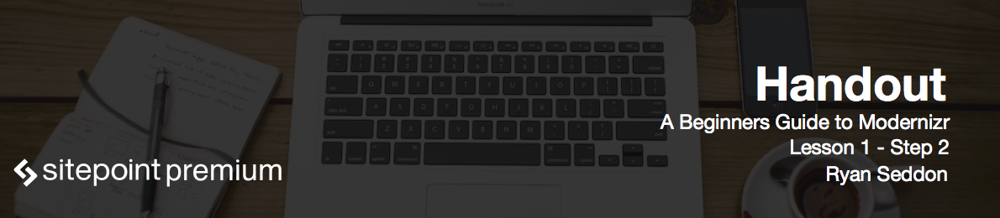

# Introduction to Modernizr

We now know what Modernizr does on a high level. Now let's head over to the [modernizr.com](https://modernizr.com/), and I'll guide you through to get your first version of Modernizr so you can begin playing with it.

# Docs

The first section we'll take a look at is the **docs**. This guides you through the features of Modernizr and how to use it, as well as providing some useful examples. I'd recommend coming back to this to help you be on the course material.

# Resources and Download

The next section is **resources**. Here we have links to the GitHub repository, where all the development of Modernizr happens, links to our design resources and some Wiki entries. Also there are links to handy blogs and tutorials that can help you out.

Lastly, there is a **download** section. It allows you to build a custom version of Modernizr with only the feature detects you need, or a development version, which contains all the feature detects. The development version should never make it to production - it should only be for testing. Through out this course we will use a development version, but when you actually put it on a real website in production, you'd want to have only the feature detects that you need. So you should revisit this page and create a custom build so the file size is kept to minimum.

Another neat feature of the Download page, is the ability to send your selected feature detects to codepen.io. This allows you test out your build straight away without having to download the JavaScript file, put it in the HTML page and then open it in the browser. It's a nice little time saver and it gives you really good visibility of what actually works in what browsers.