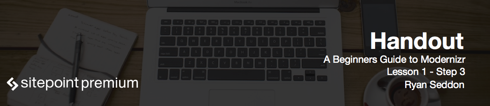

# Download Modernizr

Let's go back to the download page and we'll get our first copy of Modernizr. For the purpose of this course, we'll be using the development version as it will include everything by default. There is a little link on the homepage to get the development version straight away. While this file is quite large, incidentally it will be used while you're testing out Modernizr and it's features like we're doing in this course. Once you know what feature to text you'll need we try and recommend that you revisit the download page and create a custom build by checking the features individually.

# Custom Build of Modernizr

Once the download page has completed generating the source code, it will give you some info about it. Clicking the pink "build" button next to the feature text search field on the right will present us with some options. For now we just want to copy the build to the clipboard.

If you take a look at the source code that is generated by this build, you'll notice that it contains a helpful comment at the top that is a special URL that will let you revisit the custom build and easily make additions to your feature detect set, or even remove ones that you no longer need. Every time you create a build, that URL will be updated. So you never have to worry about keeping track of what detects you currently have.